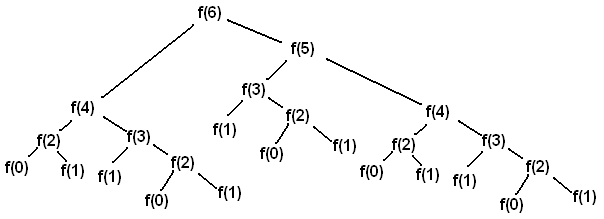
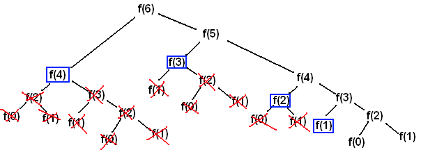

```py
```
<div align="center"> 
  
</div>

# Curso de programacion dinamica y estocastica con python

## Introduccion

programacion dinamica se escogio para esconder a patrocinadores gubernamentales el hecho que en realidad estaba haciendo Matematicas. la frase programacion dinamica es algo que ningun congresista puede oponerse. Richard Bellman.
- subestructura optima.- una solucion global optima se puede encontrar al combinar soluciones optimas de subproblemas locales.
- problemas empalmados.- una solucion optima que involucra resolver el mismo problema en varias ocaciones.
Memoization.- memorizacion es una tecnica para guardar computos previos y evitar realizarlos nuevamente, normalmente se utiliza un diccionario, donde las consultas se pueden hacer en O(1). intercambia tiempo por espacio.

## Fibonacci dinamico
El fibonacci normal tiene un comportamiento exponencial lo cual lo vuelve muy ineficiente, sin embargo cuando optimizamos el algoritmo tenemos un comportamiento lineal lo cual permite obtener resultados inmediatos.
```py
# Fibonacci exponencial
def fibonacci_recursivo(n):
    if n == 0 or n == 1:
        return 1
    return fibonacci_recursivo(n - 1) + fibonacci_recursivo(n - 2)
if __name__ == "__main__":
    n = int(input('Digita un numero: '))
    resultado = fibonacci_recursivo(n)
    print(resultado)
```
```py
Digita un numero: 6
6
5
4
3
2
1
0
1
2
1
0
3
2
1
0
1
4
3
2
1
0
1
2
1
0
13
```
El algoritmo tiene un gran parecido a la siguiente imagen, solo que volcado, todo el lado derecho en nuestro codigo esta al lado izquierdo por esta linea return fibonacci_recursivo(n - 1) + fibonacci_recursivo(n - 2) aqui vemos que primero se hace n - 1, y luego n -2.

<div align="center"> 
  
</div>

pero al colocar un numero mayor a 50 el calculo tarda cada vez mas, si cambiamos el algoritmo tenemos:
```py
def fibonacci_dinamico(n, memo = {}):
    print(n, memo)
    if n == 0 or n == 1:
        return 1
    try:
        return memo[n]
        
    except KeyError:
        resultado = fibonacci_dinamico(n - 1, memo) + fibonacci_dinamico(n - 2, memo)
        memo[n] = resultado

        return resultado
    
if __name__ == "__main__":
    n = int(input('Digita un numero: '))
    resultado = fibonacci_dinamico(n)
    print(resultado)
```
se obtiene lo siguiente:
```py
6 {}
5 {}
4 {}
3 {}
2 {}
1 {}
0 {}
1 {2: 2}
2 {2: 2, 3: 3}
3 {2: 2, 3: 3, 4: 5}
4 {2: 2, 3: 3, 4: 5, 5: 8}
13
```
pero que esta pasando realmente con el recursividad y el diccionario memo, lo que pasas es que se guarda cada vez los datos que se repiten haciendo mas eficiente los cálculos ya que no vuelve a repetirlos.
<div align="center"> 
  
</div>
<div align="center"> 
  
</div>

# Camino de Borrachos
```py
import random
from bokeh.plotting import figure, show
class Borracho: 
    
    def __init__(self, nombre): 
        self.nombre = nombre
    
class BorrachoTradicional(Borracho):  # clase base, genera un contructor con init
    
    def __init__(self, nombre):
        super().__init__(nombre)

    def camina(self): # camina aleatoriamente entre 4 opciones
        return random.choice([(0, 1), (0, -1), (1, 0), (-1, 0)]) #choice permite generar varias opciones que tienen la misma probabilidad
```
```py
class Coordenada:

    def __init__(self, x, y): #contructor
        self.x = x
        self.y = y
    
    def mover(self, delta_x, delta_y): 
        # deltas definen cuanto se mueven a cada direccion. regresa una nueva coordenada con la suma de la coordenada actual + los cambios en delta x
        #cada que generamos un cambio creamos una nueva coordenada, es inmutable, 
        return Coordenada(self.x + delta_x, self.y + delta_y) 
        
    
    def distancia(self, otra_coordenada): # estamos en una coordenada actual y necesitamos otra coordenada, para calcular la distancia usamos pitagoras
        delta_x = self.x - otra_coordenada.x #diferencia, se calcula la distancia entre dos coordenadas.
        delta_y = self.y - otra_coordenada.y 

        return(delta_x**2 + delta_y**2)**0.5

```
```py
class Campo:

    def __init__(self): #contructor
        self.coordenadas_de_borrachos = {} #crea un diccionario de las coordenadas de los borrachos.

    def añadir_borracho(self, borracho, coordenada): #que borracho queremos recibir y donde estara
        self.coordenadas_de_borrachos[borracho] = coordenada #se guarda dentro del diccionario, y se designa esta operacion a coordenada

    def mover_borracho(self, borracho): #que borracho vamos a mover
        delta_x, delta_y = borracho.camina() #cuando camina el borracho regresa una tupla, aleatorio.
        coordenada_actual = self.coordenadas_de_borrachos[borracho] #la coordenada actual guardada en el diccionario
        nueva_coordenada = coordenada_actual.mover(delta_x, delta_y) #con la coordenada actual le decimos que se mueva con el delta x, y el delta y.

        self.coordenadas_de_borrachos[borracho] = nueva_coordenada #guardamos nuevamente la coordenada del borracho en el diccionario.

    def obtener_coordenada(self, borracho):  #consulta de donde anda un borracho al final del programa.
        return self.coordenadas_de_borrachos[borracho] #devuelve el valor actual en el diccionario.           
```
```py
from camino_de_borrachos import BorrachoTradicional #importacion de clases.
from campo import Campo #campo es el modulo y Campo es la clase.
from coordenada import Coordenada 
from bokeh.plotting import figure, show

def caminata(campo, borracho, pasos):
    inicio = campo.obtener_coordenada(borracho) #cual es el inicion, nos  debe dar al inicio (0, 0)
    
    for _ in range(pasos): #para el rango de los pasos, tantos pasos se diga
        #de campo con la funcion mover borracho, se le entrega como parametro un borracho.
        campo.mover_borracho(borracho) 
        #le decimos a la coordenada de inicio 
    return inicio.distancia(campo.obtener_coordenada(borracho))

def simular_caminata(pasos, numero_de_intentos, tipo_de_borracho):
    #llamada a tipo de borracho, a diferencia de llamarlo directamente como borracho tradicional, se lo recibe como parametro de la funcion
    # lo que se hace es inicializar una instancia de borracho tradicional o de cualquier tipo de borracho que se le mande. "agnostica" recibe un borracho, cualquie tipo.
    borracho = tipo_de_borracho(nombre="David") 
    origen = Coordenada(0, 0)
    distancias = []  #variable que guarda las distancias en cada una de las simulaciones.

    """por cada intento, el _ indica que no utilizaremos variable """
    for _ in range(numero_de_intentos):
        campo = Campo() #simulacion 
        campo.añadir_borracho(borracho, origen) #se añade un borracho y un origen de coordenada. 
        simulacion_caminata = caminata(campo, borracho, pasos) #resultado de la funcion caminata, (todavia no esta implementada)
        distancias.append(round(simulacion_caminata, 1)) #añadir a las distancias la simulacion de la caminata, round permite que no tenga ningun decimal.
     
    return distancias

def graficar(x, y):
    grafica = figure(title = "Camino Aleatorio", x_axis_label= "pasos", y_axis_label = "distancias")
    grafica.line(x, y, legend = "distancia media")

    show(grafica)

""" definicion de main """
def main(distancias_de_caminata, numero_de_intentos, tipo_de_borracho):
    distancias_media_por_caminata = []
    for pasos in distancias_de_caminata: #recuerde que son 10, 100, 1000, 10000
        distancias = simular_caminata(pasos, numero_de_intentos, tipo_de_borracho)     #esto es lo que va a estar haciendo la simulacion.          
        distancia_media = round(sum(distancias) / len(distancias), 4) #4 son 3 decimales, es la media de los datos.
        distancia_maxima = max(distancias) #el dato maximo de la distancia
        distancia_minima = min(distancias)
        distancias_media_por_caminata.append(distancia_media)
        #__name__ nos da el nombre de la clase, 
        print(f"{tipo_de_borracho.__name__} caminata aleatoria de {pasos} pasos")
        print(f"Media = {distancia_media}")
        print(f"Max = {distancia_maxima}")
        print(f"Min = {distancia_minima}")
    
    graficar(distancias_de_caminata, distancias_media_por_caminata)

if __name__ == "__main__": #End point
    distancias_de_caminata = [10, 100, 1000, 10000] #simulacion de 10 pasos, 100 pasos, ... , 
    numero_de_intentos = 100           #las simulaciones se corren varias veces para obtener su media.

    """ recibir classe de borracho, en vez inizializar la clase la vamos a ponerlo como referencia """
    main(distancias_de_caminata, numero_de_intentos, BorrachoTradicional)
```

# Itroduccion a la programacion estocastica

## introduccion 
un programa es deterministico si cuando se corre con el mismo input produce el mismo output
Los programas deterministicos son muy buenos importantes, pero existen problemas que no pueden resolverse de esa manera.
la programacion estocastica permite introducir aleatoriedad a nuestros programas para crear simulaciones que permiten resolver otro tipo de problema.
Los problemas estocasticos se aprovechan de que las distribuciones probabilisticas de un problema se conocen o pueden ser estimadas.

## Estadisticas y Probabilidades 
la probabilidad es una medida de la incertidumbre asociada a un evento o suceso futuro y suele expresarse como un numero entre 0 y 1. un suceso de 0 indica que un suceso jamas sucedera. una probabilidad de 1 indica que un suceso esta garantizado en el futuro. 

P(a) + P(-a) = 1
p (a y b) = p(a) * p(b)

p(A o B) = P(a) + P(b) cuando son mutuamente exclusivos

P(A o B) = P(a) + P(b) - P(a y b) no exclusivos 

```py
import random

def tirar_dados(numero_de_tiros):
    secuencia_de_tiros = []

    for _ in range(numero_de_tiros):
        tiro = random.choice([1, 2, 3, 4, 5, 6])
        secuencia_de_tiros.append(tiro)
    
    return secuencia_de_tiros

def main(numero_de_tiros, numero_de_intentos):
    tiros = []
    for _ in range(numero_de_intentos):
        secuencia_de_tiros = tirar_dados(numero_de_tiros)
        tiros.append(secuencia_de_tiros)
    
    tiros_con_1 = 0 
    for tiro in tiros:
        if 1 in tiro:
            tiros_con_1 += 1

    probabilidad_de_tiros_con_1 = (tiros_con_1 / numero_de_intentos) * 100
    print(f"La probabilidad de tener 1 entre {numero_de_tiros} es {probabilidad_de_tiros_con_1}")

if __name__ == "__main__":
    numero_de_tiros = int(input("Cuantos tiros del dado: "))
    numero_de_intentos = int(input("Cuantas veces correra la simulacion: "))

    main(numero_de_tiros, numero_de_intentos)
```
### Inferencia Estadistica

    Permite obtener resultados poblacionales a partir de pequeñas muestras.
    La ley de los grandes numeros.- en pruebas independientes repetidas con la misma probabilidad p de un resultado, la fraccion de desviaciones de p converge a cero conforme las cantidad de pruebas se acerca al infinito.
    La falacia del apostador.- señala que despues de un evento extremo, ocurriran eventos menos extremos para nivelar la media. 
    La regresion a la media señala que despues de un evento aleatorio extremo el siguiente evento sera probablemente menos extremo.


### Media
Es una medida de tendencia central, conmunmente es conocido como el promedio, la media de una poblacion se denota con el simbolo de µ, la media de la muestra se denota con 
el codigo de la media es el siguiente: x
```py
import random

def media(X):
    return sum(X) / len(X)

#lo que importa, si ejecutamos directamente este archivo, se ejecute main, pero ahora 
#pero ahora vamos a generar un archivo helper, y no queremos que se ejecute main cada vez que importamos

if __name__ == "__main__":
    X = [random.randint(1, 21) for i in range(20)]
    mu = media(X)
    print(X)
    print(mu)
```
### Varianza

La varianza mide que tan propagados se encuentran un conjunto de valores aleatorios de su media.
mientras que la media nos da una idea de donde se encuentran los valores, la varianza nos dice que tan disperso se encuentran. 
la varianza siempre debe entenderse con respecto a la media.

### Desviacion Estandar

la desviacion estandar es la raiz cuadrada de la varianza, nos permite entender tambien la propagacion y se debe entender siempre relacionado a su media.
la ventaja sobre la varianza es que la desviacion estandar esta en las mismas unidades que la media.

### distribucion normal

Es una de  las distribuciones mas recurrentes en cualquier ambito, se define completamente por su media y su desviacion estandar, permite calcular intervalos de confianza con la regla empirica.

Regla empirica.- Tambien conocida como la regla 68-95-99.7
señala cual es la dispersion de los datos en una distribucion normal a uno, dos y tres sigmas.
permite calcular probabilidades con la densidad de la distribucion normal.

### Simulaciones de MonteCarlo

permite crear simulaciones para predecir el resultado de un problema. permite convertir problemas deterministicos en problemas estocasticos y es utilizado en una gran diversidad de areas desde la ingenieria hasta la biologia y el derecho.
cuando una variable esta en mayusculas en python significa una constante.
Aqui vemos el codigo para obtener la probabilidad de obtener un par en una baraja de 5 cartas
```py
import random
import collections

PALOS = ["espada", "corazon", "rombo", "trebol"]
VALORES = ["as", "2", "3", "4", "5", "6", "8", "9", "10", "jota", "reina", "rey"]

def crear_baraja():
    baraja = []
    for palos in PALOS:
        for valor in VALORES:
            baraja.append((palos, valor))
    
    return baraja
def obtener_mano(barajas, tamaño_mano):
    #random sample me permite obtener muestras de manera aleatoria, pero al sacar otra muestra no obtiene duplicados
    mano = random.sample(barajas, tamaño_mano)

    return mano

def main(tamaño_mano, intentos):
    barajas = crear_baraja()

    manos = []
    for _ in range(intentos):
        mano = obtener_mano(barajas, tamaño_de_mano)
        manos.append(mano)

    pares = 0
    for mano in manos:
        valores = []
        for carta in mano:
            valores.append(carta[1])

        counter = dict(collections.Counter(valores))
        for val in counter.values():
            if val == 2:
                pares += 1
                break
                
    probabilidad_par = pares / intentos
    print(f"La probabilidad de obtener un par en una mano de {tamaño_mano} barajas es {probabilidad_par}")
if __name__ == "__main__":
    tamaño_de_mano = int(input("De cuantas barajas sera la mano?: "))
    intentos = int(input("Cuantos intentos para calcular la probabilidad?: "))

    main(tamaño_de_mano, intentos)
```
codigo para obtener pi por medio de probabilidades: 
```py
import random
import math
from DesvEstandar import desviacion_estandar, media

def aventar_agujas(numero_de_agujas):
    adentro_del_circulo = 0

    for _ in range(numero_de_agujas):
        x = random.random() * random.choice([-1, 1])
        y = random.random() * random.choice([-1, 1])
        distancia_desde_el_centro = math.sqrt(x**2 + y**2)

        if distancia_desde_el_centro <= 1:
            adentro_del_circulo += 1
        
    return (4 * adentro_del_circulo) / numero_de_agujas

def estimacion(numero_de_agujas, numero_de_intentos):
    estimados = []
    for _ in range(numero_de_intentos):
        estimacion_pi = aventar_agujas(numero_de_agujas)
        estimados.append(estimacion_pi)
    
    media_estimados = media(estimados)
    sigma = desviacion_estandar(estimados)
    print(f"Estimado: {round(media_estimados,5)}, sigma: {round(sigma,5)}, agujas: {numero_de_agujas}")

    return(media_estimados, sigma)

def estimar_pi(precision, numero_de_intentos):
    numero_de_agujas = 1000
    sigma = precision

    while sigma >= precision / 1.96: #95% de probabilidad
        media, sigma = estimacion(numero_de_agujas, numero_de_intentos)
        numero_de_intentos *= 2

    return media 

if __name__ == "__main__":
    estimar_pi(0.01, 1000)

```
### muestreo

hay ocaciones en la que no tenemos acceso a toda la poblacion que queremos explorar
uno de los grandes descubrimientos de la estadistica es que las muestras aleatorias tienden a mostrar las mismas propiedades de la poblacion objetivo.
el tipo de muestro que hemos hecho hasta ahora es muestreo probabilistico.
En un muestro aleatorio cualquier miembro de la poblacion tiene la misma probabilidad de ser escogido
En un muestreo estratificado tomamos en consideracion las caracteristicas de la poblacion para partirla en subgrupos y luego tomamos muestras de cada subgrupo. 
- incrementa la probabilidad de que el muestreo sea representativo de la poblacion.

### teorema del limite central

Es uno de los teoremas mas importantes de la estadistica
Establece que muestras aleatorias de cualquier distribucion van a tener una distribucion normal
Permite entender cualquier distribucion como la distribucion normal de sus medias y eso nos permite aplicar todo lo que sabemos de distribuciones normales.
mientras mas muestras obtengamos, mayor sera la similitud con la distribucion normal
mientras la muestra sea de mayor tamaño, la desviacion estandar sera menor.

### Datos Experimentales

- es la aplicacion del metodo cientifico
- es necesario comenzar con una teoria o hipotesis sobre el resultado al que se quiere llegar
- Basado en la hipotesis se debe se debe crear un experimento para validar o falsear la hipotesis
- Se valida o falsea una hipotesis midiendo la diferencia entre las mediciones experimentales y aquellas mediciones predichas por la hipotesis.

### Regresion lineal

Permite aproximar una funcion a un conjunto de datos obtenidos de manera experimental.
No necesariamente permite aproximar funciones lineales, sino que sus variantes permiten aproximar cualquier funcion polinomica.
Para regresiones lineales se utiliza un generador de ambientes en la nube, esto se conoce como colab.research.google.com, creamos un cuaderno y empezamos a codificar. 
para utilizar mas esta nueva herramiento utilzare otas guias en mi git hub: Mauricio Obe

```py
import numpy as np
x = np.array([0, 1, 2, 3, 4, 5, 6, 7, 8])
y = np.array([1, 2, 3, 5, 4, 6, 8, 7, 9])

coeffs = np.polyfit(x, y, 1)
print(coeffs)
```
al correr el segmento: [0.96666667 1.13333333]
```py
beta = coeffs[0]
constante = coeffs[1]
estim_y = (beta * x ) + constante 
```
```py
import matplotlib.pyplot as plt
plt.plot(x)
plt.scatter(x, y)
plt.show()
```
Al correr el ultimo segmento se obtiene un grafico con todos los puntos y la funcion lineal que representa a la regresion lineal.

## Conclusiones

La programacion dinamica permite optimizar problemas que tienen subestructura optima y subestructura empalmados
Las computadoras pueden resolver problemas deterministicos y estocasticos
podemos generar simulaciones computacionales para responder preguntas del mundo real
la inferencia estadistica nos permite tener confianza de que nuestas simulaciones arrojan resultados validos.

preguntas del examen: 

